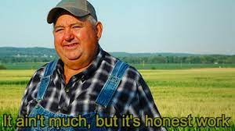

# ODIN RECIPES PROJECT #
This is a small project to showcase my learning of basic HTML through The Odin Project. It is *very* bare bones and boring. I hope to slowly make it more appealing and fun to use.:thinking:

## HTML in use so far
- index.html as landing page with boiler-plate on each page
- pages in separate directory
  - 3 recipes with refernce back to landing page
  - style in text
  - unordered and ordered lists
- images and links
  - separate directory
- all pushed and pulled to github

That's really it :neutral_face:

